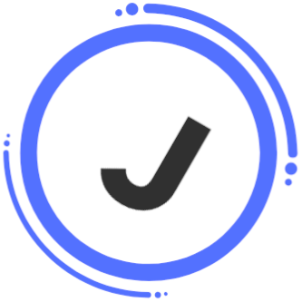

  
  <h1>JustDo</h1>

  

<h2>General Description</h2>

The application will implement a number of features to provide the user with this experience. Creation of a task will include a number of entries that encompass a broad range of typical needs, such as: General tasks, Tests(Quizzes & Exams), Homework, Projects(Personal & Group), Jobs/Work Shifts, and Meetings. The application aims to track the progress of your tasks, set your goals, help users with time management and allow users to interact and share progress with each other while working on shared tasks. 

<h2>Technologies</h2>

  <ul>
    <li>IntelliJ IDEA primary IDE</li>
    <li>Java JDK version 22, backend programming language</li>
    <li>Maven dependency management tool</li>
    <li>JavaFX Controls, Graphics, FXML frontend markup language</li>
    <li>CSS for stylying GUI components</li>
    <li>Microsoft Azure SQL Server</li>
  </ul>

<h2>Features</h2>

The application will primarily allow users to create and manage tasks, with the additional ability to create special task groups which contain sub-tasks. The user will be able to complete subtasks in the special task groups, checking them off to increase the task’s progress bar towards completion. Users can name these special task groups whatever they desire, and assign tags to be able to filter tasks by tag in addition to filtering by date. Users will be able to assign tasks priority settings based on their importance. The app will also send reminders for upcoming deadlines if the user desires, which will be determined by the due dates of tasks or starting times of meetings. A user will receive these reminders if they elect to via e-mail or notification. 

<h2>GUI Views</h2>

The application will utilize a variety of GUI views to display User task data according to the users needs at that time. The default view, or home page, will display all of a user’s individual tasks that they have created up until this point, along with tabs inserted into a FlowPane that allow a user to filter between personal tasks, group tasks, today tasks and recently completed tasks. Additionally, a user will be able to filter tasks to display all assignments on a particular day, week, or monthly view which will highlight all dates which currently have assigned tasks in a particular month. When a user selects to create a task, a new window will open displaying the relevant fields, such as Title, Due Date, Description, Add a task, Add user (If a group project). There will also be a login window and signup window for new and returning users respectively. A progress bar will also be displayed for each task, which will be filled as a user completes subtasks, or by personal selection.

<h2>Back-end Implementation</h2>

The database will be utilizing MS Azure and contain information of users, such as name, username, email, password, and tasks. Email will be used as the primary key for retrieving a user’s individual information. Email will be obfuscated when viewing another user in a group setting, displaying an individual's username instead. Updates to the database will occur on task creation or completion, with some small validation to confirm a task is completed. The database will be used to integrate basic user authentication and to securely store and retrieve each user’s tasks, individual task information and settings. 

